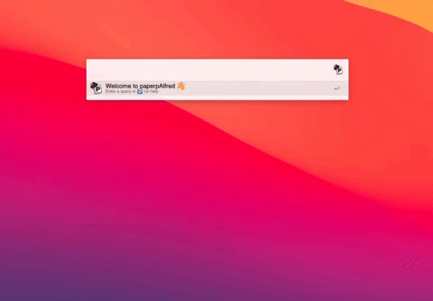
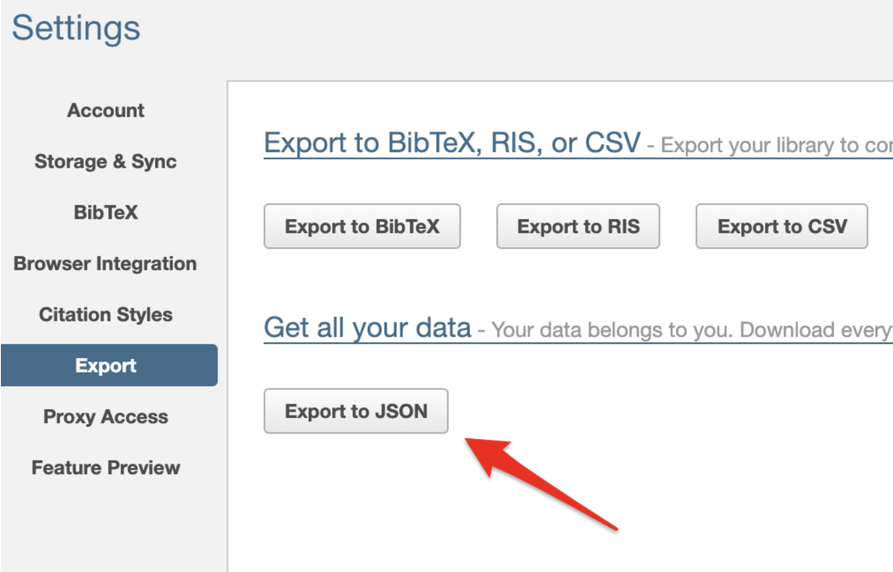

# paperpAlfred 

Search your [Paperpile](https://paperpile.com/) library with [Alfred](https://www.alfredapp.com/)

<!-- MarkdownTOC autolink="true" bracket="round" depth="3" autoanchor="true" -->

- [Setting up](#setting-up)
- [Basic Usage](#basic-usage)
- [Output](#output)
- [Known Issues](#known-issues)
- [Acknowledgments](#acknowledgments)
- [Changelog](#changelog)
- [Feedback](#feedback)

<!-- /MarkdownTOC -->

# Setting up paperpAlfred

1. Download the workflow from Github and double-click to install paperpAlfred
2. Download your Paperpile library 
	- in Paperpile, cogwheel > Settings > Export > Export to JSON
		
3. Set the `PAPLIBRARY` path
	- Copy the library file path to the clipboard 
		- In Alfred, search the file, right arrow, select `Copy Path to Clipboard`
		- In Finder, right-click the file, press option (⌥), the select `Copy [FileName] as Pathname`
		- Open the 'Configure Workflow and Variables' window in paperpAlfred preferences
				
	- paste the path to library as the `PAPLIBRARY` value
4. _Optional:_ Set `PAPPATH` (Path to Paperpile in Google Drive)
	- this will allow to open PDFs in the system viewer
	- go to the Paperpile folder in Google Drive, copy the path as in Step 3
	- paste the path to Paperpile as the `PAPPATH` value in the 'Configure Workflow and Variables' window in paperpAlfred 
5. _Optional:_ change the max number of results returned (default: 99)
	- Set the `MAXRESULTS` value in the 'Configure Workflow and Variables' window in paperpAlfred 
6. _Optional:_ Setup hotkeys to launch 
	- main search 
	- filter by label 
	- filter by folder 

# Basic Usage 

## Simple search
- launch paperpAlfred by typing `ppp` or using an optional hotkey
- words or names will be searched across all fields

### Filter by label first
- entering `ppl`  (or optional hotkey) will show a list of labels, the number of items in each label, and the count of item types
- select the label by pressing `return`. PaperpAlfred will now search within that label
	- `option-return (⌥⏎)` will open the label in Paperpile
### Filter by folder first
- entering `ppf` (or optional hotkey) will show a list of folders, the number of items in each folder, and the count of item types
- select the folder by pressing `return`. PaperpAlfred will now search within that folder. 
	- `option-return (⌥⏎)` will open the folder in Paperpile
- Note: Added feature ✅ the Paperpile web interface does not allow to search by folder
### Filter by type first
- entering `ppty` will show a list of publication types and the number of items in each
- select the folder by pressing `return`. paperpAlfred will now search within that item type
	- `shift-return (⇧⏎)` will open the folder in Paperpile
       
## Advanced search
- enter `field:`, where `field` is any of the fields below. Example: `year:2020`
	- `title`
	- `abstract`
	- `citekey`
	- `first` first author
	- `last` last author
	- `journal`
	- `folder`
	- `label`
	- `pmid`
	- `year`
	- `type` publication type

# Output
- Alfred returns the top 99 results, numbered. The max number of results returned can be set in Preferences (see __Setting up paperpAlfred__)
- results are sorted by year (most recent first). Adding `--a` to the query will invert this order. 
- The main text will return the title.
- the subtext will return the following: 
	- record count/total result count
	- 📜if a PDF is available
	- short ID string (first-last author, journal, year)
	- associated labels

## Acting on results
Once the right item is found, the user has seven options to act on it:
1. `return (⏎)` will open the PDF in the system viewer (Preview for most users), provided that the `PAPPATH` has been set (see [Setting up](#setting-up)). Rarely this might not work (see [Known Issues](#known-issues))
2. `shift-return (⇧⏎)` will show the **abstract** and copy it to clipboard
3. `control-return (⌃⏎)` will show the **complete reference** and copy it to the clipboard
4. `option-return (⌥⏎)` will copy a **short reference** (First-last author, journal, year, PMID) to the clipboard
5. `command-return (⌘⏎)` will copy the **citation key** to the clipboard
6. `command-shift-return (⌘⇧⏎)` will open the PDF in Google drive
7. `command-option-return (⌘⌥⏎)` will open the record in Paperpile

# Known issues 

- incomplete records will not be imported
- special characters (e.g. ü) will need to be entered in order to match the record
- File opening is currently using a name search. The Paperpile file naming logic is not entirely clear to me, the folder structure is deprecated and there might be a small number of cases where the PDF might not be retrievable via paperpAlfred. Google drive view should still work in these cases. 
- Currently tested mainly with research papers, reviews etc. There might be untested use cases for other types of publications. 
- label and folder search in the main window (i.e. using `label:` and `folder:`) will not be exact matches (e.g. AD will also return GWAS_AD). Match will be exact when starting from folder and label window.

# Acknowledgments

- [Dean Jackson](https://github.com/deanishe) for their incredible help on the Alfred mailing list and for creating [alfred-index-demo](https://github.com/deanishe/alfred-index-demo), and other scripts used as templates for this workflow. 
- Jirka from Paperpile for support on the path-to-file issue
- Alain T, StackExchange user:5237560 (https://nebularena.wordpress.com) for help with a Python script

# Changelog

- 03-17-2021: version 1.0

# Feedback

Feedback welcome! If you notice a bug, or have ideas for new features, please feel free to get in touch either here, or on the [Paperpile](https://forum.paperpile.com)/[Alfred](https://www.alfredforum.com) forums. 

